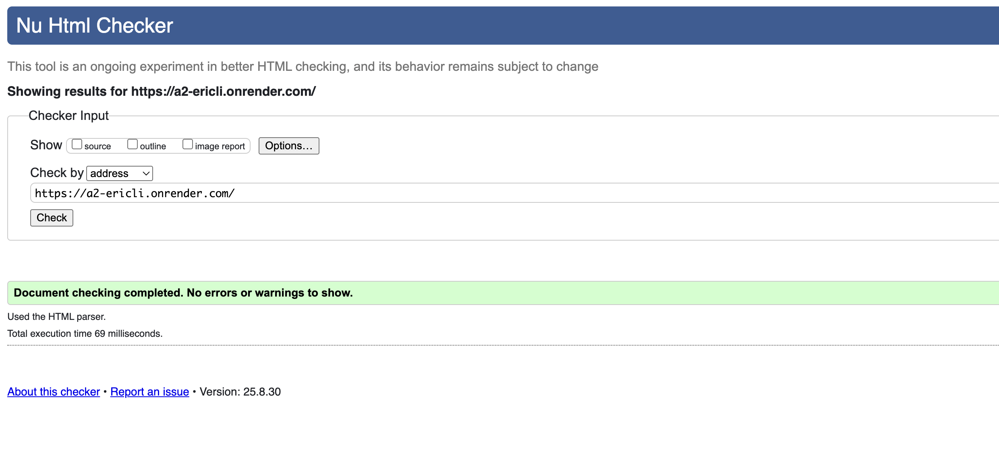

Deployed at: https://a2-ericli.onrender.com/

Validate site here: https://validator.w3.org/nu/?doc=https%3A%2F%2Fa2-ericli.onrender.com%2F

## The Best Todo List

What I made here is a simple, easy to use todo list application. A user enters 3 fields: Task title, Description of the task, and a Due date. The user will then click the "submit" button and see their task in the Todo list, along with a server derived field for days left.

CSS Positioning technique:
We have positioned the entire ui (user enter field and all tasks) in a container with flex display column direction. We also defined a max width for the container, allowing for some whitespace on the borders for easy viewing. The todo-form div is inside of this container and has content centered in it. The todo-table which lists all tasks currently on the server is given width 100% within the container for ckear display of relevant information.

## Technical Achievements
- **Tech Achievement 1 (SPA)**:

I have created a single page app that both provides a form for users to submit data and always shows the current state of the server-side data. When the form is submitted, Javascript intercepts the event and send the data using fetch, avoiding the default effect of reloading the page upon form submission. The server proccesses the data, calculates derived field of daysLeft, and responds with the updated list of todos. The client then updates the displayed todo list to always show the current state of server data. All changes such as adding, editing, completing, or deleting tasks are instantly shown on the page, makings ure the UI is always in syunc with the server. 

- **Tech Achievement 2 (Modifying existing data)**:

I have added the capability of editing existing data by creating a new endpoint in teh server "/edit" which takes updated fields, derives the days left, and gives a reponse back to the client with the edited task. We iterate by idx for each task for consistency across the project. The client calls the server through clicking a pencil icon that serves as edit, calling the "/edit" endpoint explained previously, and displaying a popup where the user can edit the fields. Once the user clicks ok, the backend data would update with the provided data, and the frontend will re-render the todo list to keep the two in sync.

### Design/Evaluation Achievements
- **Design Achievement 1**: 

TASK: Create 3 tasks, edit one of them, delete a different one, refresh page to see if data still there

Person 1:
1. Li
2. Problems: Strike through is unclear, delete should have confirmation, make data more readable
3. Comments: I'm suprised that the strik-through is unclear.
4. What would I change about the interface: Add a short guide at the top explaining what each possible interaction could be. The alert suggestion is a good idea. I implemented it using some help from gpt to learn how to get the edge of an element using the getBoundingClientRect() function on a selected element. The rest was similar to to the edit overlay, just with the adition of a guideSteps array of Json formatted steps to follow. 

Person 2:
1.
2. Problems:
3. Comments:
4. What would I change about the interface: