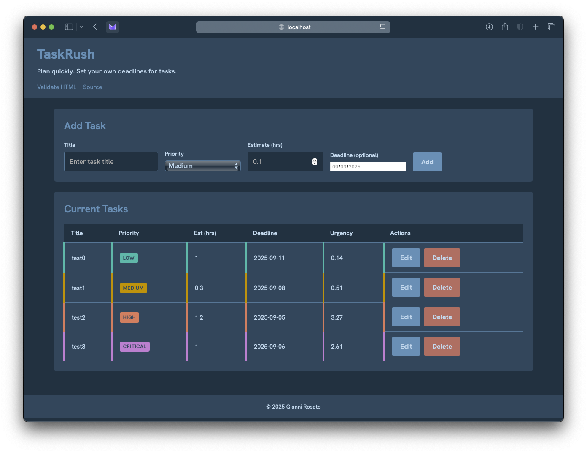

# TaskRush Priority Task Planner

TaskRush is a single-page web app that helps you plan tasks. It has customizable deadlines and an automatic urgency calculation based on priority. Built with vanilla HTML, CSS, and JavaScript with Node.js, this app demonstrates the two-tier web app architecture.

Screenshot:

## Dataset & Derived Field Explanation

The application maintains an in-memory dataset of tasks with the following fields:
- `id`: Unique identifier (UUID) generated by server
- `title`: Task description (string) provided by user
- `priority`: Importance (low|medium|high|critical) selected by user
- `estimateHrs`: Time estimate in hours (number) entered by user
- `deadline`: Due date (YYYY-MM-DD) – (optional) field entered by user
    - If not provided, will just say "No deadline"
- `createdAt`: Creation Unix timestamp generated by server
- `urgencyScore`: Urgency rating (derived field) computed from priority weight & time until deadline
    - `(priorityWeight / hoursUntilDeadline)` rounded to 2 decimal places, where priorityWeight maps priorities to weights (low=1, medium=2, high=3, critical=5). If no deadline is set, urgency is based on priority only.

## How to Use

1. Add a task by filling in the form with a title, priority level, time estimate, and optionally a deadline, and clicking "Add"
2. Edit a task by clicking the "Edit" button on any task row to load it into the form, make changes, and click "Save"
3. Delete a task by clicking the "Delete" button on any task row and confirm the deletion
4. While in edit mode, click "Cancel Edit" to return to add mode

All operations update the displayed task list immediately and sync with the server.

## Technical Achievements

### Single-Page Application

TaskRush is implemented as a true single-page application where:
- All user interactions happen on one page without full page reloads
- The UI dynamically updates based on server responses
- State is maintained in JavaScript and synchronized with the server
- All CRUD operations (Create, Read, Update, Delete) are performed via AJAX calls

### Modify Existing Data

Beyond basic add/delete functionality, TaskRush supports full editing capabilities:
- PUT endpoint on the server to update existing records
- Form mode switching between "Add" and "Edit" states
- Re-computation of derived fields when tasks are updated
- Visual indication of which task is being edited

### Client-Side Optimistic UI with Rollback

TaskRush implements advanced client-side state management:
- Optimistic Updates: UI updates immediately when user performs actions
- Automatic Rollback: If server requests fail, the UI automatically reverts to the previous state
- Error Handling: Clear error messages are displayed when operations fail
- State Snapshots: The application maintains snapshots of the task list before operations for rollback purposes

## Design/UX Achievements

### User Experience Enhancements

TaskRush incorporates several thoughtful UX improvements:
- Color-coded priority indicators
- Responsive design that works on mobile and desktop
- Smooth scrolling
- Confirmation dialogs for destructive actions
- Empty state messaging when no tasks exist
- Accessible form controls
- Keyboard navigable interface

## Validation

- [HTML Validation](https://validator.w3.org/nu/?doc=https%3A%2F%2Fgiannirosato-a25.onrender.com) - All HTML markup validates correctly
- [CSS Validation](https://jigsaw.w3.org/css-validator/validator?uri=https%3A%2F%2Fgiannirosato-a25.onrender.com%2Fstyles.css) - All CSS styling validates correctly

## Deployment

The application is deployed on Render at: https://giannirosato-a25.onrender.com

To run locally:
1. Clone the repository
2. Run `npm install` or `deno install` to install dependencies
3. Run `npm start` or `deno run start` to start the server
4. Visit `http://localhost:3000` in your browser

## Future Improvements

Potential enhancements for future versions:
- Local storage persistence for offline usage
- Task sorting and filtering options
- Task completion tracking
- Data export functionality
- Dark/light theme toggle

## AI Disclosure

LLMs were used to assist with planning and formatting the final README.
